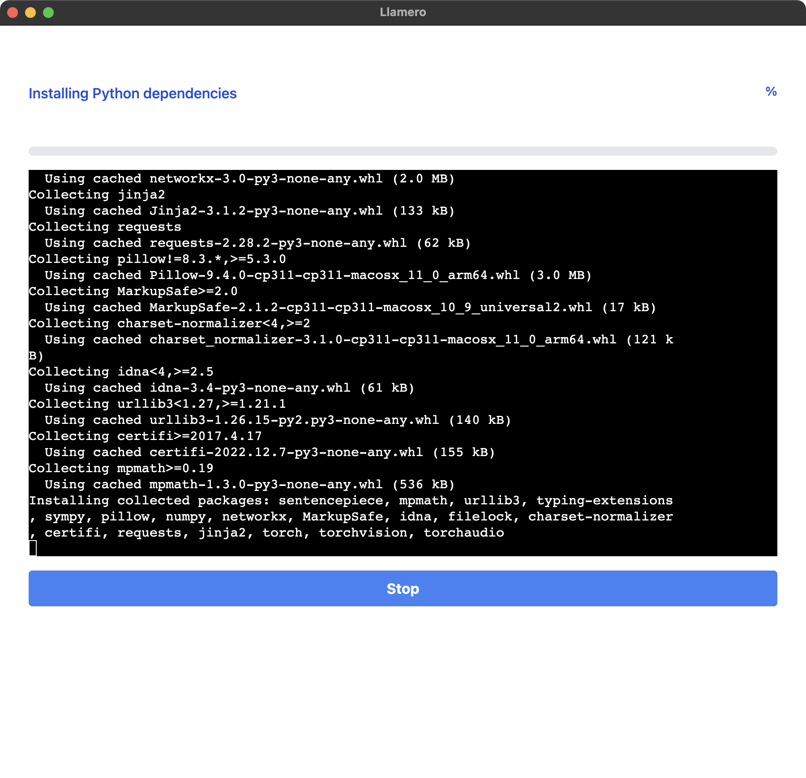
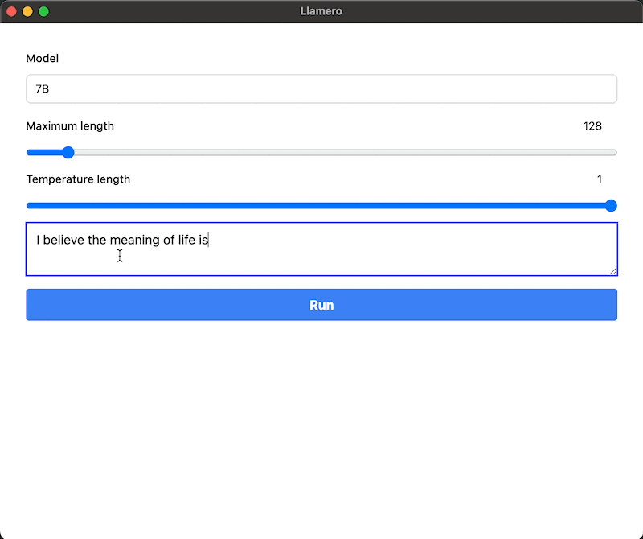

# Llamero

A GUI application to easily try out Facebook's LLaMA models.

## [Download the latest release](https://github.com/mpociot/llamero/releases)

## Usage

This is a cross-platform GUI application that makes it super easy to download, install and run any of the [Facebook LLaMA](https://github.com/facebookresearch/llama) models.

It uses the models in combination with [llama.cpp](https://github.com/ggerganov/llama.cpp), which uses 4-bit quantization and allows you to run these models on your local computer.

In the UI you can choose which model(s) you want to download and install.

After installing one or multiple models, you will be provided with a "Playground" that allows you to locally infer the models. You can also configure parameters such as the temperature and maximum token length.

## Limitations

Facebook's LLaMA model is not finetuned for question answering, but instead tries to continue writing existing prompts. Take this into account when interacting with these models.

Additionally, even though the app is cross-platform I have personally only tested the macOS version of it.

## Credits

This project is inspired by [Dalai](https://github.com/cocktailpeanut/dalai) and uses a modified version of their query and installation script.

## Sponsors

### [What The Diff](https://whatthediff.ai/?ref=gh-llamero) - your AI powered code review assistant

